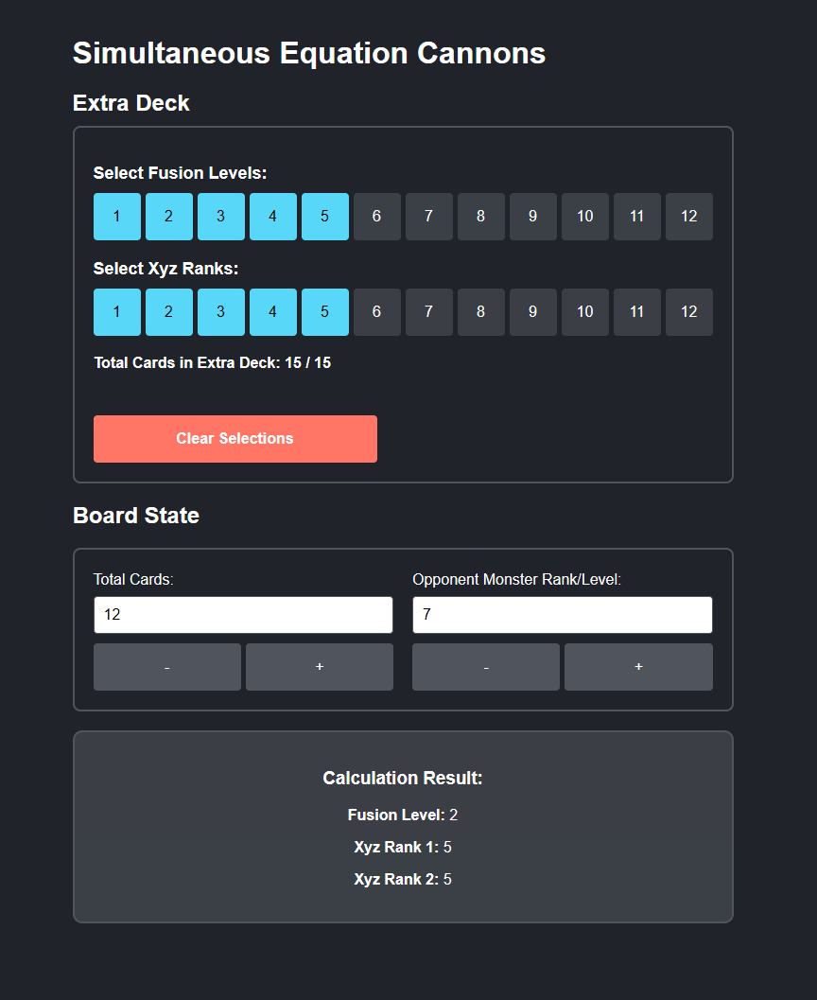

# Yu-Gi-Oh! Simultaneous Equation Cannons Calculator



This React application calculates the valid combinations for the Yu-Gi-Oh! card effect **Simultaneous Equation Cannons**. Users can input total cards, opponent monster rank/level, and select Fusion Levels and Xyz Ranks to determine valid combinations for resolving the card's effect.

# Features

- **Input Validation**:
  - Total cards and opponent monster rank/level cannot be negative.
  - Opponent monster rank/level is capped at a maximum of 12.
- **Extra Deck Constraints**:
  - Fusion and Xyz card selection is limited to a maximum of 15 total cards.
  - Each Xyz card counts as 2 cards toward the total.
- **Dynamic Calculation**:
  - Displays valid Fusion Levels and Xyz Ranks based on user inputs.
  - Updates results dynamically without moving other UI elements.

# Getting Started

## Installation

1. Clone the repository:
    ```bash
    git clone https://github.com/jjangsangy/simultaneous-equation-cannon.git
    ```
2. Navigate to the project directory:
    ```bash
    cd simultaneous-equation-cannon
    ```
3. Install dependencies:
    ```bash
    npm install
    ```

## Usage
1. Start the development server:
    ```bash
    npm start
    ```
2. Open the app in your browser at `http://localhost:3000`

## Deployment

To build the app for production:

```bash
npm run build
```

The production-ready files will be in the build/ directory.

##  How to Use

1. Input the total number of cards on the field and in both players' hands.
2. Input the opponent's monster rank or level (0-12).
3. Select desired Fusion Levels and Xyz Ranks, adhering to the extra deck constraints.
4. View the calculated valid combinations in the results section.